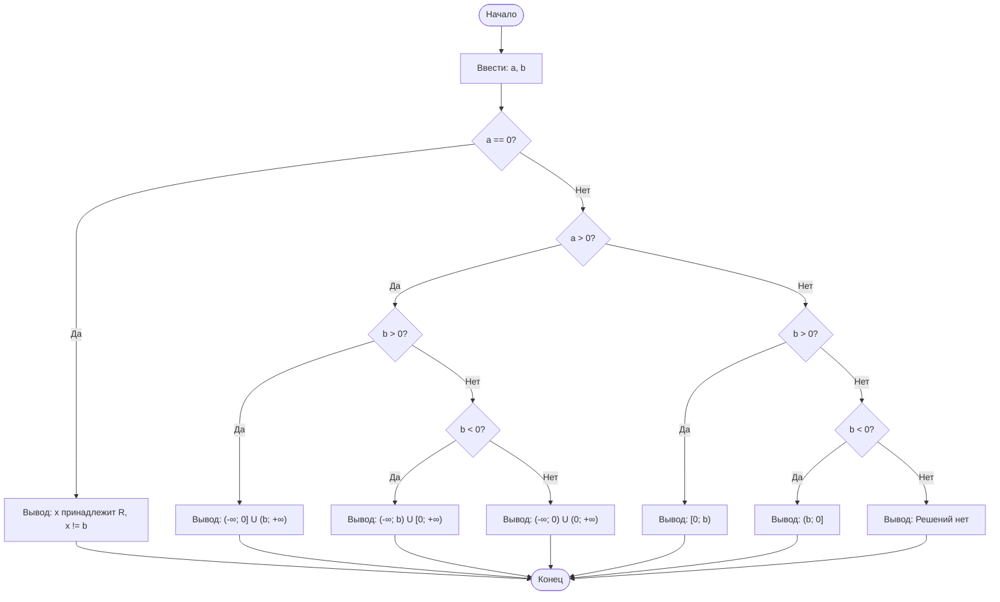

## Отчет по лабораторной работе № 1

#### № группы: `ПМ-2601`

#### Выполнила: `Есева Нелли Алексеевна`

#### Вариант: `8`

### Содержание:

- [Постановка задачи](#1-постановка-задачи)
- [Входные и выходные данные](#2-входные-и-выходные-данные)
- [Выбор структуры данных](#3-выбор-структуры-данных)
- [Алгоритм](#4-алгоритм)
- [Программа](#5-программа)
- [Анализ правильности решения](#6-анализ-правильности-решения)

### 1. Постановка задачи

> Дано неравенство: `a * (x / (x - b)) >= 0`. Где `a` и `b` — параметры (вводятся с клавиатуры). Решить его для `x`. При этом нельзя использовать класс `Math`.

Данную задачу можно разделить на несколько подзадач: анализ области допустимых значений (ОДЗ) и определение знаков числителя и знаменателя.

- Для начала нужно учесть ОДЗ: знаменатель не может быть равен нулю.
  1. `x - b != 0` (отрицание случая деления на ноль)
- Далее необходимо рассмотреть знак параметра `a`, так как от него зависит направление знака неравенства:
  1. `a > 0`
  2. `a < 0`
  3. `a == 0`
- В зависимости от знака `a`, анализируем знак дроби `x / (x - b)`:
  1. Если `a > 0`, дробь должна быть `>= 0` (числитель и знаменатель одного знака).
  2. Если `a < 0`, дробь должна быть `<= 0` (числитель и знаменатель разных знаков).

Всего надо рассмотреть несколько комбинаций знаков `a` и `b`.

### 2. Входные и выходные данные

#### Данные на вход

На вход программа должна получать 2 числа, при этом в условии не сказано, к какому множеству принадлежать получаемые числа, поэтому будем считать их вещественными. Также даны верхняя и нижняя границы получаемых чисел.

|          | Тип                | 
|----------|--------------------|
| a (Параметр) | Вещественное число | 
| b (Параметр) | Вещественное число | 

#### Данные на выход

Т.к. программа должна вывести решение неравенства, то на выход мы получим множество значений `x` (числовые промежутки) в виде текстового описания.

|          | Тип                            | 
|----------|--------------------------------|
| Решение  | Текстовое описание промежутков | 

### 3. Выбор структуры данных

Программа получает 2 вещественных числа, не превышающих по модулю 10<sup>9</sup> < 2<sup>30</sup>. Поэтому для их хранения можно выделить 2 переменные (`a` и `b`) типа `double`.

|                | название переменной | Тип (в Java) |
|----------------|---------------------|--------------|
| a (Параметр)   | `a`                 | `double`     |
| b (Параметр)   | `b`                 | `double`     |

Для вывода результата необязательно его хранить в отдельной переменной.

### 4. Алгоритм

#### Алгоритм выполнения программы:

1. **Ввод данных:**
   Программа считывает два вещественных числа, обозначенные как `a` и `b`.

2. **Анализ параметра `a`:**
   Программа проверяет значение `a`. Если `a == 0`, неравенство превращается в `0 >= 0`, что верно для любого `x`, кроме `x = b`.

3. **Определение знака дроби (при `a != 0`):**
   - Если `a > 0`: неравенство сводится к `x / (x - b) >= 0`. Числитель и знаменатель должны быть одного знака.
   - Если `a < 0`: неравенство сводится к `x / (x - b) <= 0`. Числитель и знаменатель должны быть разных знаков.

4. **Вывод результата:**
   В зависимости от значений `a` и `b`, на экран выводится описание соответствующих числовых промежутков.

#### Блок-схема



### 5. Программа

```java
import java.io.IOException;
import java.util.Scanner;

public class Main{
    public static void main(String[]args)
    throws IOException {
        Scanner in = new Scanner(System.in);
            //считываем параметры a и b
            double a = in.nextDouble();
            double b = in.nextDouble();
            //решаем неравенство a * (x / (x - b)) >= 0 относительно x
            if (a == 0) {
            //если a = 0, левая часть равна 0 поэтому неравенство будет верно при любом x не равном b
                System.out.printf("x принадлежит R и не равно %s%n", b);
            }
            else if (a > 0){
            //если а > 0, знак дроби должен быть >= 0 (числитель и знаменатель одного знака)
                if (b>0){
                    System.out.printf("х принадлежит (-∞; 0] U (" + b + "; +∞)");
                }
                else if (b<0){
                    System.out.printf("x принадлежит (-∞; " + b + ") U [0; +∞)");
                }
                else if (b==0){
                    System.out.printf("x пренадлежит R и не равно 0");
                }
            }
            else{
            //если a < 0, знак дроби должен быть <= 0 (числитель и знаменатель разных знаков)
                if (b>0){
                    System.out.printf("x преналдежит [0; " + b + ")");
                }
                else if (b<0){
                    System.out.printf("x принадлежит (" + b + "; 0]");
                }
                else{
                    System.out.printf("нет решений");
                }
            }
        }
}
```

### 6. Анализ правильности решения

Программа работает корректно на всем множестве решений с учетом ограничений.

1. Тест на `a >0, b > 0`:

    - **Input**:
        ```
        2 5
        ```

    - **Output**:
        ```
        "x принадлежит от (-∞; O] U (5.0; +∞)"
        ```

2. Тест на `a >0, b < 0`:

    - **Input**:
        ```
        2 -3
        ```

    - **Output**:
        ```
        "х принадлежит (-∞; -3.0) U [O; +∞)"
        ```

3. Тест на `a < 0, b > 0`:

    - **Input**:
        ```
        -1 4
        ```

    - **Output**:
        ```
        "х принадлежит [0; 4.0)"
        ```

4. Тест на `a < 0, b < 0`:

    - **Input**:
        ```
        -1 -2
        ```

    - **Output**:
        ```
        "х принадлежит (-2.0; 0]"
        ```

5. Тест на `a = 0`:

    - **Input**:
        ```
        0 10
        ```

    - **Output**:
        ```
        x принадлежит R и не равно 10.0
        ```
